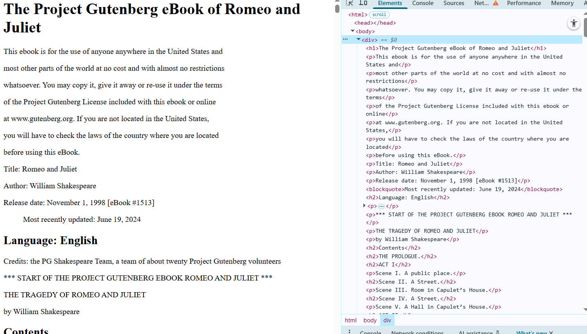

`outputExample.txt` - приклад виводу з консолі

`DebugFlyweightBook.txt` - зпаршена книжка з файлу `book.txt`, що знаходиться у папці `bin`, з використанням легковаговика та власного LightHTML

`DebugFlyweightBook.html` - тей самий файл, що й `DebugFlyweightBook.txt`, але вручну змінив тип файлу до .html

#### файл 'DebugFlyweightBook.txt' створюється в іншій директорії, сюди виніс його вручну

